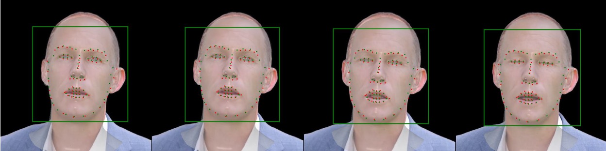

<h1 align="center"><b>⚡️ Lightning Track ⚡️</b></h1>
<div align="center"> 
    <div align="center"> 
        <b>🚀 Track with landmark 🚀</b> 
        &nbsp;&nbsp;&nbsp;&nbsp;&nbsp;&nbsp;&nbsp;&nbsp;&nbsp;&nbsp;&nbsp;&nbsp;
        <b>🚅 Track with synthesis 🚅</b>
    </div>
    <div align="center"> 
        <b></b>
        <b></b>
    </div>
</div>

<div align="center"> 
    <b>🧐 Landmarks (2D/3D) and bounding box 🧐</b>
</div>
<div align="center"> 
    
</div>

## Description
**Lightning Track** is a monocular face tracker built on FLAME. It provides optimized FLAME parameters and camera parameters, along with the bounding box and landmarks used during optimization.

Our tracker operates at a remarkable speed 🚀, processing 250 frames in approximately 60 seconds under landmark mode and 250 frames in around 200 seconds under synthesis mode.


## Installation
### Build environment
<details>
<summary><span >Install step by step</span></summary>

```
conda create -n track python=3.9
conda install pytorch==2.0.1 torchvision==0.15.2 torchaudio==2.0.2 pytorch-cuda=11.8 -c pytorch -c nvidia
conda install -c fvcore -c iopath -c conda-forge fvcore iopath
conda install pytorch3d -c pytorch3d
pip3 install mediapipe tqdm rich lmdb einops colored ninja av opencv-python scikit-image onnxruntime-gpu onnx transformers pykalman
```

</details>
<details>

<summary><span style="font-weight: bold;">Install with environment.yml (recommend)</span></summary>

```
conda env create -f environment.yml
```

</details>

<details>

<summary><span>Run with Dockerfile</span></summary>

```
If your environment has unknown or unsolvable issues, use the Dockerfile as a final solution.
```

</details>

### Build source
Check the ```build_resources.sh```.


## Fast start

Track on video:
```
python track_video.py -v demos/demo.mp4 --synthesis
```
or track all videos in a directory:
```
python track_video.py -v demos/ --no_vis
```
